# Software Requirements Specification (SRS)
## CodeFlow — Code Base Visualisation & Architectural Analysis Platform

**Version:** 1.0
**Date:** June 22, 2026
**Prepared from:** Actual implementation in `/Backend` (FastAPI + Neo4j) and `/Frontend` (Vue 3 + Vue Flow)

> Diagrams in this document use **Mermaid** syntax. They render automatically on GitHub, GitLab, Notion, and in VS Code with the "Markdown Preview Mermaid Support" extension. To convert this file to Word/PDF with diagrams rendered as images, use Pandoc with a Mermaid filter, or open the rendered preview and "Print to PDF/Word".

---

## Table of Contents
1. [Introduction](#1-introduction)
2. [Overall Description](#2-overall-description)
3. [System Architecture](#3-system-architecture)
4. [Use Case Model](#4-use-case-model)
5. [Functional Requirements (System Features)](#5-functional-requirements-system-features)
6. [Data Flow Diagrams](#6-data-flow-diagrams)
7. [AI Engineering Design](#7-ai-engineering-design)
8. [Preliminary Test Plan](#8-preliminary-test-plan)
9. [Timeline](#9-timeline)
10. [Data Model (ER Diagram)](#10-data-model-er-diagram)
11. [Sequence Diagrams](#11-sequence-diagrams)
12. [State Diagram](#12-state-diagram)
13. [External Interface Requirements](#13-external-interface-requirements)
14. [Non-Functional Requirements](#14-non-functional-requirements)
15. [Other Constraints & Assumptions](#15-other-constraints--assumptions)

---

## 1. Introduction

### 1.1 Purpose
This document specifies the software requirements for **CodeFlow**, a web-based platform that ingests a developer's source code (single file, ZIP archive, or full folder) and produces an interactive, multi-tier visual map of the codebase together with automated architectural, quality, and risk analysis. The SRS is derived from the **actual implemented system** (not just the design plan) so that it reflects working, verifiable behavior.

### 1.2 Scope
CodeFlow allows a user to:
- Upload source code (Python, JavaScript, TypeScript, Java, Go, Rust, C, C++, C#).
- Visualize the codebase as a drill-down graph: **Module → File → Function → Chunk**.
- Search for any function/file/module across the uploaded project.
- Detect software architecture patterns (MVC, Layered, Clean, Hexagonal, Repository, GoF patterns).
- Detect layered-architecture rule violations.
- Detect code smells (function, module, and architecture level) and obtain an AI-generated refactor plan.
- Compute dependency risk scores and change-impact (reverse call graph) analysis for any function.
- Detect dead/unreachable code and unused imports.
- View aggregated code metrics (LOC, cyclomatic/cognitive complexity, Halstead metrics, Maintainability Index).
- View Git commit history with estimated quality metrics per commit (if `.git` is included in the upload).
- Operate within an isolated, auto-expiring user session backed by a Neo4j graph database.

Out of scope: code editing/modification, real-time collaborative editing, CI/CD integration, and IDE plugin delivery.

### 1.3 Definitions, Acronyms and Abbreviations
| Term | Meaning |
|---|---|
| AST | Abstract Syntax Tree |
| CC | Cyclomatic Complexity |
| MI | Maintainability Index |
| Fan-in / Fan-out | Number of callers / callees of a function |
| God File/Module | A file/module with disproportionately high function count or complexity |
| Tier 1/2/3 | Module-level / File-level / Function-level graph view |
| DFD | Data Flow Diagram |
| ERD | Entity Relationship Diagram |
| LLM | Large Language Model (Groq `llama-3.3-70b-versatile`) |

### 1.4 References
- Backend source: `Backend/main.py`, `analyzer.py`, `pattern_detector.py`, `smell_detector.py`, `smell_graph.py`, `db.py`, `llm_engine.py`
- Frontend source: `Frontend/src/components/GraphView.vue`, `FunctionNode.vue`, `BottomBackEdge.vue`, `Frontend/src/services/sessionManager.js`
- Project planning docs: `CONTEXT.md`, `.instructions.md`, `PHASES.md`

### 1.5 Overview
Section 2 describes the product context and actors. Section 3 shows system architecture. Section 4 gives the use-case model. Section 5 lists detailed functional requirements per feature. Sections 6–9 provide DFDs, the ER/graph data model, sequence diagrams, and the session state diagram. Sections 10–12 cover interfaces, non-functional requirements, and constraints.

---

## 2. Overall Description

### 2.1 Product Perspective
CodeFlow is a standalone, self-contained web application with a decoupled frontend (Vue 3 SPA) and backend (FastAPI REST API), backed by a Neo4j graph database for persisted code-graph storage and an external LLM API (Groq) for AI-assisted refactor reasoning.

### 2.2 Product Functions (Summary)
| # | Feature | Description |
|---|---|---|
| F1 | Code Upload & Ingestion | Accepts file / ZIP / folder, validates and parses source |
| F2 | Multi-language Parsing | Tree-sitter based AST parsing across 6+ languages |
| F3 | 3-Tier Graph Visualization | Module → File → Function drill-down with Vue Flow |
| F4 | Search | Full text search across functions/files/modules |
| F5 | Architecture Pattern Detection | MVC, Layered, Clean, Hexagonal, Repository, GoF patterns |
| F6 | Layer Violation Analysis | Detects illegal cross-layer calls |
| F7 | Code Smell Analysis | Static smell detection + LLM refactor plan |
| F8 | Change Impact Analysis | Reverse call graph for a selected function |
| F9 | Dependency Risk Scoring | Fan-in based risk ranking |
| F10 | Dead Code Detection | Unreachable functions & unused imports |
| F11 | Code Metrics Dashboard | LOC, complexity, Halstead, Maintainability Index |
| F12 | Git History & Evolution | Per-commit quality trend (if `.git` present) |
| F13 | Session Management | Isolated, auto-expiring per-user sessions |

### 2.3 User Classes and Characteristics
| User Class | Description |
|---|---|
| **Developer / Code Reviewer** | Uploads a project to understand structure, locate risky/dead code, and review architecture before refactoring |
| **Software Architect** | Uses pattern detection and layer-violation analysis to audit architectural compliance |
| **QA / Tech Lead** | Uses code smell, metrics, and Git history panels to track quality trends over time |
| **System Administrator** | Monitors active sessions via `/admin/sessions`, ensures cleanup and resource limits |

### 2.4 Operating Environment
- **Frontend:** Modern browsers (Chrome, Edge, Firefox) — Vue 3 SPA served via Vite.
- **Backend:** Python 3.x, FastAPI + Uvicorn, runs on any OS with network access to Neo4j Aura (cloud) and Groq API.
- **Database:** Neo4j (cloud-hosted, v6.1.0), with in-memory cache fallback if unreachable.

### 2.5 Design and Implementation Constraints
- Parsing is AST-based (Tree-sitter); dynamic/reflective calls are not tracked.
- Maximum upload: 50 MB total, 1000 files, 2 MB per source file.
- Git history limited to the last 30 commits for performance.
- Session data isolated by `session_id`; not designed for real-time multi-user collaboration on the same project.

### 2.6 Assumptions and Dependencies
- Internet connectivity is required for Neo4j Aura and Groq LLM calls.
- Uploaded code is trusted enough to parse (no code execution occurs server-side).
- If Neo4j is temporarily unavailable, the system falls back to an in-memory cache for the current session only.

---

## 3. System Architecture

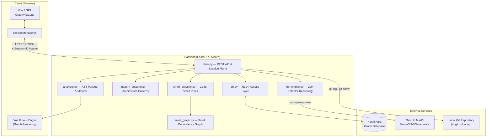

---

## 4. Use Case Model

### 4.1 Use Case Diagram

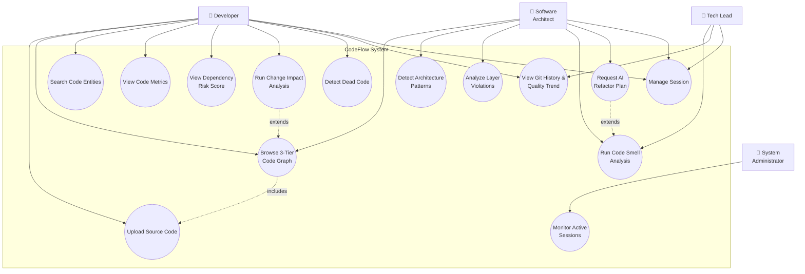

### 4.2 Use Case Descriptions

**UC1 — Upload Source Code**
- **Actor:** Developer
- **Precondition:** Active session exists (auto-created on app load).
- **Flow:** User selects a single file, a ZIP, or a folder → frontend validates extension/size → POST `/upload` → backend extracts (if ZIP), filters ignored directories, parses with Tree-sitter, builds graphs, stores in Neo4j, returns Tier-1 graph + metrics.
- **Postcondition:** Session now holds the parsed project graph; Tier-1 view is rendered.
- **Alternate flow:** Invalid file type / oversized upload / zip-slip path → reject with error message.

**UC2 — Browse 3-Tier Code Graph**
- **Actor:** Developer / Architect
- **Flow:** User clicks a Module node → GET `/graph/tier2/{module_name}` → file-level graph rendered. User clicks a File node → GET `/graph/tier3?file_path=...` → function-level graph rendered. User clicks a Function node → GET `/expand/{function_name}` → inline callers/callees shown.
- **Postcondition:** Breadcrumb trail updated; user can navigate back via "← Back".

**UC3 — Search Code Entities**
- **Actor:** Developer
- **Flow:** User types a query in the search box → client-side/REST search returns matching functions/files/modules with risk badge → clicking a result focuses/centers that node in the graph (loading the relevant tier if not visible).

**UC5 — Detect Architecture Patterns**
- **Actor:** Architect
- **Flow:** GET `/api/patterns/{session_id}` → `pattern_detector.py` runs rule-based detectors (MVC/MVP, Layered, Clean, Hexagonal, Repository, GoF) against the parsed graph → confidence-scored results with evidence and violations rendered in the Architecture Patterns panel.

**UC6 — Analyze Layer Violations**
- **Actor:** Architect
- **Precondition:** Folder/ZIP upload (multi-file structure required).
- **Flow:** GET `/layer-violations` → backend checks Controller→Service→Repository→Model call ordering → violations grouped by module/severity → displayed in Layer Analysis panel.

**UC7 — Run Code Smell Analysis**
- **Actor:** Architect / Tech Lead
- **Flow:** GET `/smell-analysis` → `smell_detector.py` evaluates function/module/architecture-level smell rules → `smell_graph.py` builds a smell dependency graph and root-cause ranking → results (severity chips, ranked files, expandable detail) shown in Smell Analysis panel.

**UC8 — Request AI Refactor Plan** (extends UC7)
- **Actor:** Architect
- **Flow:** User clicks "AI Refactor Plan" → POST `/llm-refactor-reason` with smell summary → `llm_engine.py` prompts Groq LLM → response parsed into executive summary, root cause, prioritized steps (pattern, target, effort, risk), and long-term recommendation → rendered in LLM plan box.

**UC9 — View Dependency Risk Score**
- **Actor:** Developer
- **Flow:** GET `/risk-score` → functions ranked by fan-in into High/Medium/Low/None risk buckets → top functions shown with "Changing this will affect N caller(s)" warning.

**UC10 — Run Change Impact Analysis** (extends UC2)
- **Actor:** Developer
- **Flow:** User hovers/selects a function node → GET `/impact-analysis/{function_name}` → backend performs BFS over the reverse call graph → affected functions/files/modules with hop-depth returned → impact overlay tooltip rendered on canvas.

**UC11 — Detect Dead Code**
- **Actor:** Developer
- **Flow:** GET `/dead-code` → backend flags functions with fan-in = 0 that are not recognized entry points, classified by confidence (high for private, medium for public); unused imports listed per file.

**UC12 — View Git History & Quality Trend**
- **Actor:** Developer / Tech Lead
- **Precondition:** Uploaded ZIP/folder contains a `.git` directory.
- **Flow:** GET `/git-history` → backend runs `git log`/`git show` (last 30 commits), estimates LOC/function count/MI per commit → paginated commit table with churn and net delta rendered.

**UC13 — Manage Session**
- **Actor:** Any user
- **Flow:** On app load, frontend calls POST `/start-session` (or restores ID from `sessionStorage`); all subsequent requests carry `X-Session-ID`; on tab close, `sendBeacon` triggers DELETE `/end-session`; backend also auto-expires sessions after 3 hours via a background cleanup task.

**UC14 — Monitor Active Sessions**
- **Actor:** Administrator
- **Flow:** GET `/admin/sessions` → returns list of all active sessions with metadata for operational monitoring.

> **Note:** The Service Tier / monorepo microservice-detection capability (service graph, per-service drill-down, auto-detected inter-service connections) is implemented in code (`service_call_detector.py`, `GET /service-graph`) but is intentionally left out of this SRS revision — use case model, functional requirements, DFDs, ER diagram, and sequence diagrams — and will be documented here once the feature is finalized for release.

### 4.3 Activity Diagram — Code Smell Analysis & AI Refactor Plan (UC7, UC8)

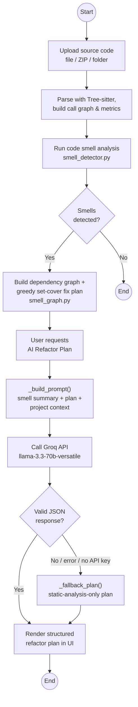

### 4.4 Activity Diagram — Overall System Workflow

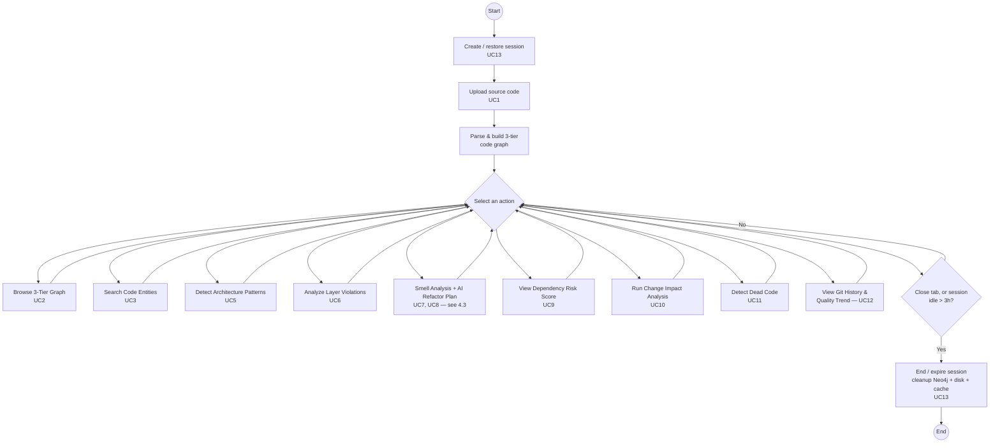

---

## 5. Functional Requirements (System Features)

### 5.1 FR-1: Code Upload & Ingestion
- FR-1.1: System shall accept a single source file, a ZIP archive, or a directory (via folder picker).
- FR-1.2: System shall reject files exceeding 2 MB (single file) or uploads exceeding 50 MB / 1000 files in total.
- FR-1.3: System shall sanitize ZIP entries to prevent path traversal ("zip-slip") and skip directories such as `node_modules`, `.git` (except for history extraction), `venv`, `dist`, `build`.
- FR-1.4: System shall display upload progress with stage labels.

### 5.2 FR-2: Multi-Language Parsing & Metrics
- FR-2.1: System shall parse Python, JavaScript, TypeScript, Java, Go, Rust, C, C++, and C# using Tree-sitter.
- FR-2.2: System shall extract, per function: name, parameters, line range, cyclomatic complexity, fan-in, fan-out.
- FR-2.3: System shall build an internal call graph using only same-project function calls (external/stdlib calls excluded).
- FR-2.4: System shall classify large files by line count and AST function count, and chunk "god files" into virtual modules for readability, as follows:
  - FR-2.4.1: A file with ≤ 10,000 lines is classified “normal”. Above that threshold, it is classified by AST-parsed function count: < 3 functions → “data file” (excluded from god-file chunking); 3–100 functions → “large normal”; > 100 functions → “god file”.
  - FR-2.4.2: Recognized generated-file suffixes (`.pb.go`, `.pb.gw.go`, `_grpc.pb.go`, `.gen.go`, `.generated.go`, `_generated.go`) are always classified “god file” regardless of size, unless they exceed 100,000 lines, in which case they are treated as a “data file” and skipped.
  - FR-2.4.3: A god file is split into virtual modules using the first strategy that yields a usable result, in priority order: (1) class-based — one virtual module per class, containing its methods; (2) complexity-based — High (cyclomatic complexity > 15) / Medium (5–15) / Low (≤ 5) buckets, used when no classes are found; (3) line-range — fixed groups of 50 functions labeled by line span, used as the final fallback.
  - FR-2.4.4: A Tier-3 (file-level) request for a chunked god file shall return the chunk-level graph (one node per virtual module) instead of every function individually; selecting a chunk (Tier-4) drills into that chunk’s own functions.
  - FR-2.4.5: Chunking is a purely structural, read-only grouping — it does not alter parsed function identity, call-graph edges, or computed metrics.

### 5.3 FR-3: 3-Tier Graph Visualization
- FR-3.1: System shall render Tier-1 (module), Tier-2 (file), Tier-3 (function), and Tier-4 (chunk) graphs using Vue Flow with Dagre auto-layout.
- FR-3.2: System shall support click-to-drill-down and a breadcrumb/back-navigation stack.
- FR-3.3: System shall provide a MiniMap and pan/zoom Controls.
- FR-3.4: System shall visually distinguish node types (Module, File, Function, Chunk, Root/orphan file) and risk levels by color/icon.

### 5.4 FR-4: Search
- FR-4.1: System shall support full-text search across function, file, and module names.
- FR-4.2: Search results shall display entity type, file path, and risk badge.
- FR-4.3: Selecting a result shall load the relevant tier (if not already visible) and focus the node.

### 5.5 FR-5: Architecture Pattern Detection
- FR-5.1: System shall detect MVC/MVP, Layered Architecture, Clean Architecture, Hexagonal Architecture, Repository Pattern, and common GoF design patterns (Singleton, Observer, Factory, Facade).
- FR-5.2: Each detected pattern shall include a confidence score, supporting evidence, and component-to-layer mapping.
- FR-5.3: System shall list architecture rule violations associated with detected patterns.

### 5.6 FR-6: Layer Violation Analysis
- FR-6.1: System shall validate that calls only flow Controller → Service → Repository → Model (utility layers callable from any layer).
- FR-6.2: Violations shall be reported with source file, target reference, severity (High/Medium), and explanation, grouped by module.
- FR-6.3: This feature requires folder/ZIP upload (not applicable to single-file upload).

### 5.7 FR-7: Code Smell Analysis & AI Refactor Plan
- FR-7.1: System shall detect function-level smells: Long Method, Too Many Parameters, Dead Code, Feature Envy, Deep Nesting, Switch Smell, Magic Numbers.
- FR-7.2: System shall detect module-level smells: God Module, God Class, Large Module, Lazy Class, Duplicate Code, Data Clumps, Shotgun Surgery.
- FR-7.3: System shall detect architecture-level smells: Circular Dependency, Long Call Chain, Inappropriate Intimacy, Divergent Change.
- FR-7.4: System shall build a smell dependency graph and compute root-cause ranking via BFS and a greedy set-cover fix-ordering algorithm.
- FR-7.5: On user request, system shall call an LLM (Groq `llama-3.3-70b-versatile`) to generate an executive summary, root cause, prioritized refactor steps (with effort/risk), and a long-term recommendation.

### 5.8 FR-8: Change Impact Analysis
- FR-8.1: For a selected function, system shall compute the full reverse call graph (all transitive callers) via BFS.
- FR-8.2: Results shall indicate hop-depth (direct vs. indirect caller) and aggregate affected files/modules.
- FR-8.3: System shall render an overlay showing the top affected functions with an option to view the full list.

### 5.9 FR-9: Dependency Risk Scoring
- FR-9.1: System shall classify every function into High (≥10 callers), Medium (3–9), Low (1–2), or None (0) risk based on fan-in.
- FR-9.2: System shall rank and display the top 50 highest-risk functions with a caller-count warning.

### 5.10 FR-10: Dead Code Detection
- FR-10.1: System shall flag functions with zero fan-in that are not recognized entry points (e.g., `main`, lifecycle hooks, test methods, web route handlers).
- FR-10.2: Flagged functions shall carry a confidence level: High (private, no callers) or Medium (public, no callers — may be used dynamically/externally).
- FR-10.3: System shall list unused imports per file.

### 5.11 FR-11: Code Metrics Dashboard
- FR-11.1: System shall compute and display LOC, SLOC, file/function counts, average/max cyclomatic complexity, cognitive complexity, decision points, Halstead volume/difficulty, and Maintainability Index (0–100, color-coded).
- FR-11.2: System shall report max call-chain depth, circular dependency count (with chains), and orphan node count.

### 5.12 FR-12: Git History & Evolution Tracking
- FR-12.1: If the upload contains a `.git` directory, system shall extract up to the last 30 commits via `git log`/`git show`.
- FR-12.2: For each commit, system shall report hash, message, author, date, insertions/deletions, churn, and net delta, plus estimated LOC/function count/MI at that point in history.
- FR-12.3: The commit table shall be paginated (10 rows per page, "load more").

### 5.13 FR-13: Session Management
- FR-13.1: System shall create a unique session (UUID) per user on first load and persist it in `sessionStorage`.
- FR-13.2: All API requests shall carry an `X-Session-ID` header; backend data (Neo4j nodes, disk uploads, in-memory cache) shall be isolated per session.
- FR-13.3: Sessions shall auto-expire after 3 hours of inactivity via a background cleanup task (every 30 minutes); explicit cleanup shall occur via `sendBeacon` on tab close.
- FR-13.4: An admin endpoint shall list all active sessions for monitoring.

---

## 6. Data Flow Diagrams

### 6.1 DFD — Level 0 (Context Diagram)

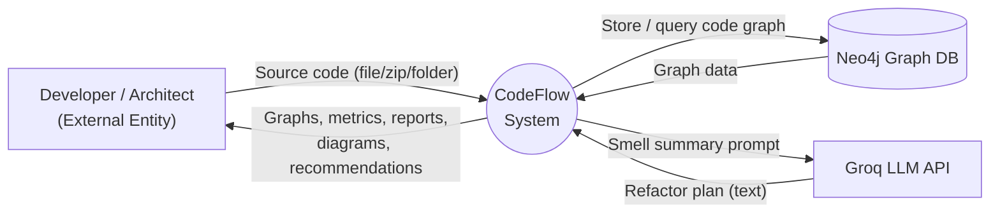

### 6.2 DFD — Level 1 (Major Processes)

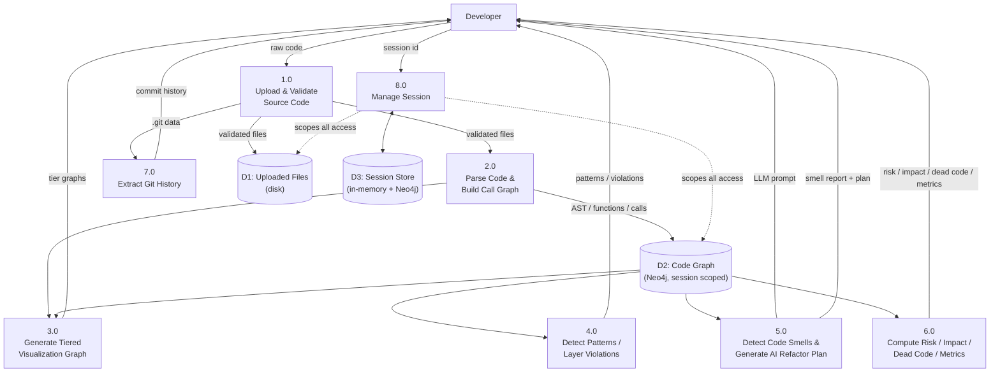

---

## 7. AI Engineering Design

### 7.1 Purpose & Role in the Pipeline
Static analysis (`smell_detector.py` + `smell_graph.py`) determines **what** is architecturally wrong and produces a preliminary, purely rule-based fix plan via a greedy set-cover ordering over the smell dependency graph. The AI layer (`llm_engine.py`) is invoked only on explicit user request (UC8) to reason about **why** the smells occurred and **how** to fix them with architectural judgment — it never runs automatically and never replaces the static analysis, only enriches it.

Two independent LLM-backed capabilities exist:
- `get_refactor_plan()` — turns the smell summary + preliminary plan into a prioritized, risk-assessed architectural refactor plan (UC8).
- `get_code_preview()` — given one smell, generates a short before/after code snippet illustrating the suggested fix.

### 7.2 Model & Configuration
| Setting | Value |
|---|---|
| Provider | Groq Chat Completions API |
| Model | `llama-3.3-70b-versatile` (env override: `GROQ_MODEL`) |
| Temperature | 0.20 (low — favors deterministic, structured output over creativity) |
| Response format | Forced JSON object (`response_format={"type":"json_object"}`) |
| Credentials | `GROQ_API_KEY` (loaded from `Backend/.env`) |

### 7.3 Prompt Engineering Design
**Data-only input contract** — the LLM never receives raw source code or file contents. It is deliberately restricted to structured, pre-computed data:
- Smell summary (total smell count, per-type counts, top root causes)
- Preliminary minimal-fix plan (top 6 steps from the static greedy set-cover algorithm)
- Project scale context (file/function counts, average complexity, max call-chain depth)

This keeps the prompt small and token-efficient, and prevents the model from "inventing" issues not grounded in the static analysis.

**System prompt hard rules** (`_SYSTEM` in `llm_engine.py`) constrain the model to:
- Identify the single primary root cause driving the smell cluster, not a list of unrelated issues.
- Recommend only structural/architectural refactors — never trivial stylistic cleanups.
- Justify each step's ordering by its downstream impact on other smells.
- Use precise GoF/Fowler pattern names (Extract Class, Move Method, Facade, etc.) rather than vague advice.
- Optimize for minimal change with maximum smell reduction.
- Return strictly valid, compact JSON — no markdown or prose outside the JSON object.

**Output contract** — the model must return: `executive_summary`, `primary_root_cause`, `smell_root_causes` (primary/secondary), `refactor_plan[]` (each with `priority`, `pattern`, `target`, `what_to_do`, `why_this_first`, `resolves_smells`, `estimated_effort`, `risk`, `risk_reason`), and `long_term_recommendation`.

### 7.4 Design Diagram

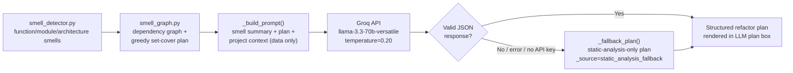

### 7.5 Reliability & Fallback Design
The AI Refactor Plan feature is designed to **degrade gracefully rather than fail**. If the API key is missing, the `groq` package isn't installed, the API call raises an exception, or the response fails JSON parsing, `get_refactor_plan()` returns a deterministic fallback plan derived purely from the static analysis (tagged `_source: "static_analysis_fallback"` with an `_error` field for diagnostics), so the Smell Analysis panel always has a fix plan to display, with or without the LLM (FR-7.5).

---

## 8. Preliminary Test Plan

### 8.1 Testing Objectives
- Verify multi-language parsing (Python, JavaScript, TypeScript, Java, Go, Rust, C, C++, C#) produces correct function inventories, call graphs, and complexity metrics.
- Verify the 3-tier drill-down (Module → File → Function → Chunk) stays consistent — correct breadcrumb state, correct scoping of child nodes to their parent.
- Validate architecture pattern detection, layer-violation analysis, code smell detection, dead-code detection, and risk scoring against known/representative code fixtures.
- Verify the AI Refactor Plan gracefully falls back to the static-analysis-only plan when the Groq API is unavailable or misconfigured (Section 7.5).
- Verify session isolation: two concurrent sessions never see each other's uploaded data, graphs, or analysis results.
- Verify upload validation and security controls: zip-slip path rejection, oversized file/archive rejection, disallowed directory filtering (`node_modules`, `venv`, etc.).
- Verify the system meets the performance targets defined in the Non-Functional Requirements (Section 14).

### 8.2 Test Scope
| In Scope | Out of Scope |
|---|---|
| All REST endpoints in `main.py` | Load/stress testing beyond the 500-concurrent-session NFR target |
| Frontend drill-down, search, and panel rendering (Vue Flow) | Cross-browser pixel-perfect UI testing |
| Static analyzers: `analyzer.py`, `pattern_detector.py`, `smell_detector.py`, `smell_graph.py` | Real-time multi-user collaborative editing (explicitly out of scope, Section 1.2) |
| AI Refactor Plan + its fallback path (`llm_engine.py`) | Third-party Groq model quality/accuracy evaluation |
| Session lifecycle (creation, expiry, cleanup) | CI/CD pipeline integration (not yet part of the project) |

### 8.3 Test Levels & Types
| Level | Technique | Notes |
|---|---|---|
| Unit | pytest, function-level assertions | Analyzer functions (complexity calc, fan-in/out, smell rules) tested against small synthetic code snippets |
| Integration | FastAPI `TestClient` | Upload → parse → store → query round-trip per endpoint |
| System / End-to-End | Manual, browser-driven | Full upload-to-analysis walkthroughs per the existing `TESTING_VERIFICATION_GUIDE.md` pattern |
| Security | Manual + targeted unit tests | Zip-slip payloads, oversized uploads, symlink entries |
| Performance | Manual timing against NFR targets | Tier-1/2/3 response time, search latency, god-file chunking time |

### 8.4 Test Environment
- Backend: local FastAPI + Uvicorn instance (`python -m uvicorn main:app --reload`).
- Frontend: local Vite dev server (`npm run dev`).
- Database: Neo4j Aura test instance, with in-memory cache fallback verified by simulating a Neo4j outage.
- AI: a valid `GROQ_API_KEY` for the success path, and a deliberately unset/invalid key to exercise the fallback path.

### 8.5 Sample Test Cases (Preliminary)
| ID | Feature / UC | Scenario | Expected Result |
|---|---|---|---|
| TC-01 | UC1 Upload | Upload a ZIP with a path-traversal (`../../`) entry | Upload rejected with a zip-slip error; no files written outside the target directory |
| TC-02 | UC1 Upload | Upload a folder exceeding 50 MB / 1000 files | Upload rejected with a size/count-limit error |
| TC-03 | UC2 Browse | Click a Module → File → Function in sequence | Correct Tier-2/Tier-3 graphs returned; breadcrumb reflects the path; "← Back" restores the prior tier |
| TC-04 | UC7/UC8 Smell + AI | Trigger AI Refactor Plan with `GROQ_API_KEY` unset | Response has `_source: "static_analysis_fallback"`; UI still renders a complete plan |
| TC-05 | UC10 Impact Analysis | Request impact analysis for a function with 3 transitive callers | Response lists all 3 callers with correct hop-depth (direct vs. indirect) |
| TC-06 | UC13 Session | Leave a session idle past the 3-hour expiry window | Background cleanup task removes the session's Neo4j nodes, cache, and disk uploads on its next run |
| TC-07 | UC14 Admin | Call `GET /admin/sessions` | Returns metadata for every currently active session |

### 8.6 Entry / Exit Criteria
- **Entry:** Feature's endpoint(s) implemented and manually reachable; test fixtures (sample source files) prepared per language.
- **Exit:** All sample test cases above pass; no open Critical/High severity defects; performance targets in Section 14 met on the reference test environment.

---

## 9. Timeline

### 9.1 Gantt Chart

[Placeholder for Gantt Chart Image/Table]

---

## 10. Data Model (ER Diagram)

CodeFlow's persistent store is a **property graph (Neo4j)** rather than a relational database. The diagram below is expressed in ER notation to show entities, attributes, and relationships.

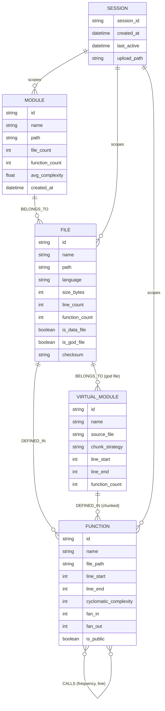

**Notes:**
- All nodes are tagged with `session_id` to isolate per-user data within the shared Neo4j instance.
- `CALLS` is a many-to-many self-relationship on `FUNCTION`, carrying `frequency` and `line` properties.
- `VIRTUAL_MODULE` exists only for "god files" that are split for readability; it sits between `FILE` and `FUNCTION`.

---

## 11. Sequence Diagrams

### 11.1 Sequence — Upload & Initial Analysis (UC1)

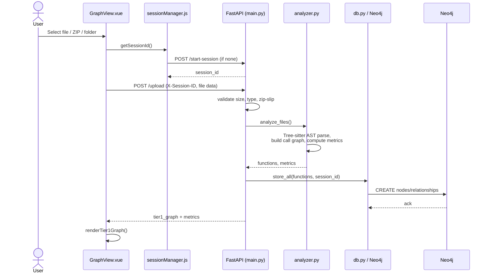

### 11.2 Sequence — Drill-Down Navigation (UC2)

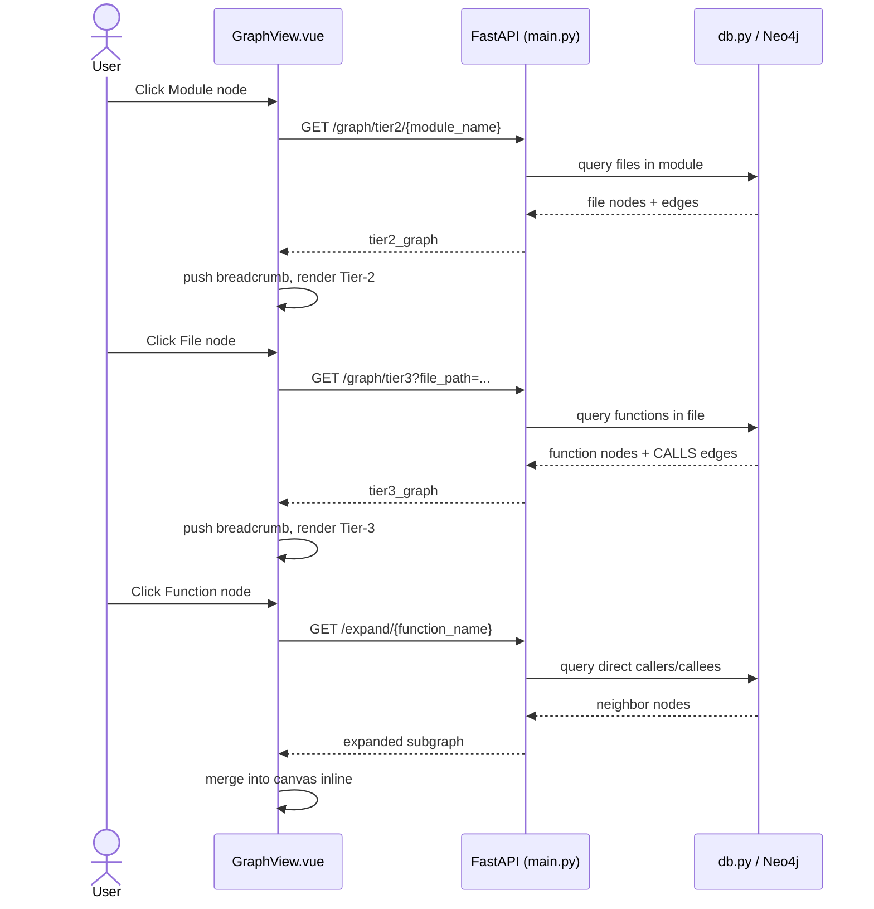

### 11.3 Sequence — Change Impact Analysis (UC10)

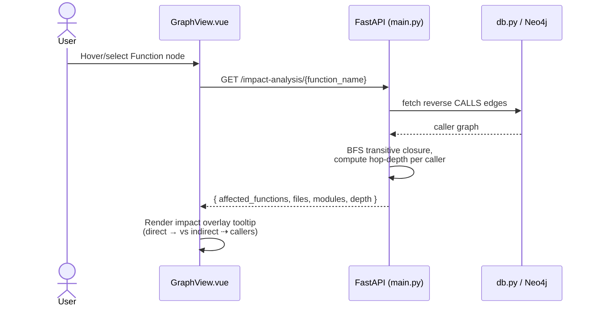

### 11.4 Sequence — Code Smell Analysis + AI Refactor Plan (UC7, UC8)

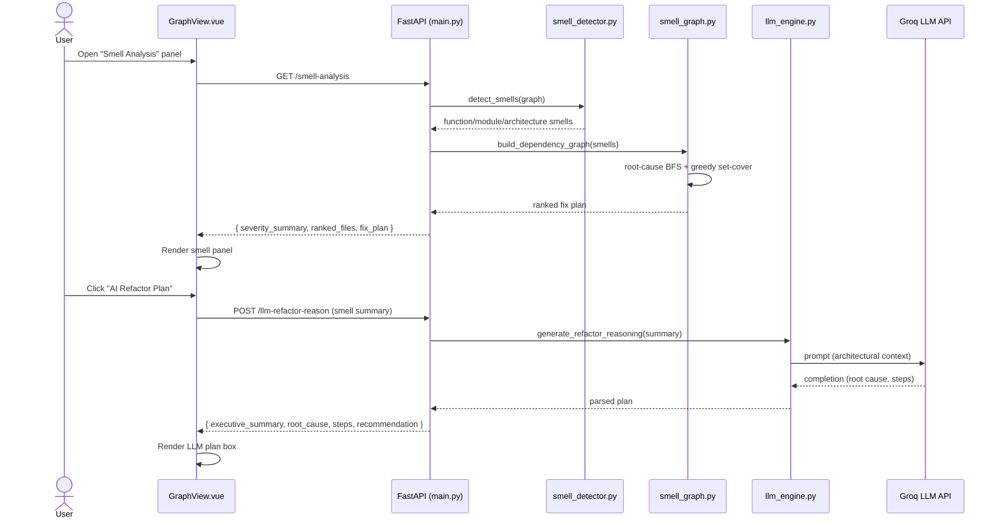

### 11.5 Sequence — Session Lifecycle (UC13)

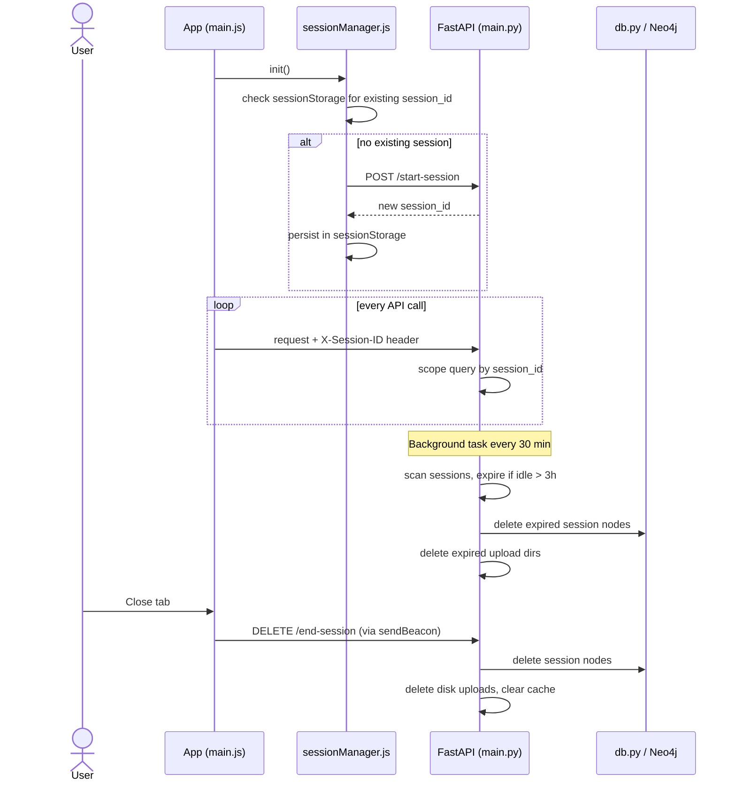

---

## 12. State Diagram

### 12.1 Session Lifecycle State Diagram

The diagram below models the lifecycle states of a single user **session** — the central stateful entity in CodeFlow (see FR-13 and UC13) — from creation to cleanup.

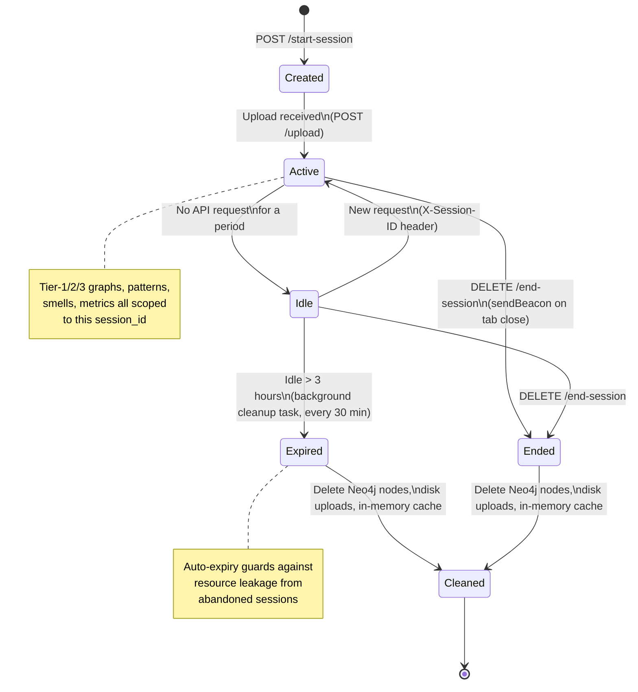

**State descriptions:**
| State | Meaning |
|---|---|
| **Created** | Session UUID issued via `POST /start-session`; no project data yet |
| **Active** | At least one upload processed; session holds a live code graph in Neo4j/cache |
| **Idle** | Session exists but has received no requests recently |
| **Expired** | Idle session that crossed the 3-hour inactivity threshold; picked up by the 30-minute background cleanup task |
| **Ended** | User explicitly closed the tab/session (`DELETE /end-session` via `sendBeacon`) |
| **Cleaned** | Terminal housekeeping state — Neo4j nodes, disk uploads, and in-memory cache for the session are deleted |

---

## 13. External Interface Requirements

### 13.1 User Interfaces
- Single-page application (Vue 3) with a resizable left sidebar (upload, status, search, legend, metrics, git history, smell analysis, risk, dead code, patterns, layer analysis panels) and a main canvas (Vue Flow graph with MiniMap and Controls).

### 13.2 Software Interfaces (REST API)
| Method | Endpoint | Purpose |
|---|---|---|
| GET | `/health` | Health check + active session count |
| POST | `/start-session` | Create a new session |
| DELETE | `/end-session` | Clean up a session |
| GET | `/sessions/info` | Current session metadata |
| GET | `/admin/sessions` | List all active sessions |
| POST | `/upload` | Upload & analyze file/zip/folder |
| GET | `/graph/tier1` | Module-level graph |
| GET | `/graph/tier2/{module_name}` | File-level graph |
| GET | `/graph/tier3?file_path=` | Function-level graph |
| GET | `/graph/chunk?file_path=&chunk_name=` | Function graph for a chunked god file |
| GET | `/graph/files` | All-files flat graph |
| GET | `/expand/{function_name}` | Direct callers/callees of a function |
| GET | `/risk-score` | Dependency risk ranking |
| GET | `/impact-analysis/{function_name}` | Reverse call graph / change impact |
| GET | `/dead-code` | Unreachable functions & unused imports |
| GET | `/layer-violations` | Architectural layer rule violations |
| GET | `/metrics` | Aggregated code metrics |
| GET | `/git-history` | Commit history with quality estimation |
| GET | `/smell-analysis` | Code smell detection + fix plan |
| POST | `/llm-refactor-reason` | LLM-based architectural reasoning |
| GET | `/api/patterns/{session_id}` | Architecture pattern detection |

### 13.3 Communication Interfaces
- Frontend ↔ Backend: HTTPS/JSON REST, `X-Session-ID` custom header for session scoping.
- Backend ↔ Neo4j: Bolt protocol (Neo4j driver) to Neo4j Aura cloud instance.
- Backend ↔ Groq: HTTPS REST call to Groq Chat Completions API.

---

## 14. Non-Functional Requirements

| Category | Requirement |
|---|---|
| **Performance** | Parse 100 files in <2s; Tier-1 graph in <5s; Tier-2 in <1s; Tier-3 in <500ms; search over 1000+ functions in <1s; god-file chunking in <10s |
| **Security** | Zip-slip prevention, filename sanitization, symlink rejection, max file size/count enforcement, no server-side code execution, per-session data isolation |
| **Scalability** | Designed to support 500+ concurrent isolated sessions; in-memory + Neo4j dual caching |
| **Reliability** | Falls back to in-memory cache if Neo4j is unreachable; conservative (false-negative biased) dead-code detection to avoid false positives |
| **Maintainability** | Modular backend (`analyzer`, `pattern_detector`, `smell_detector`, `smell_graph`, `llm_engine`, `db` separated by responsibility) |
| **Usability** | Drill-down navigation with breadcrumbs, color-coded risk/severity indicators, in-app "How to Use" guidance |
| **Availability** | Session auto-cleanup every 30 minutes prevents resource leakage; sessions expire after 3 hours of inactivity |

---

## 15. Other Constraints & Assumptions

- Dynamic/reflective function calls (e.g., calls via string lookup, `eval`, decorators that wrap call sites) are **not** tracked by the static AST-based analyzer — this is a known limitation acknowledged in the Dead Code and Risk Score panels.
- Layer Violation Analysis and Git History features require a **folder/ZIP upload**; they do not apply to single-file uploads.
- The AI Refactor Plan feature depends on third-party LLM availability (Groq); if the API is unavailable, the static smell report is still available without the AI-generated plan.
- Git History extraction assumes the uploaded archive/folder includes a valid `.git` directory with accessible commit objects.

---

*End of Software Requirements Specification.*
